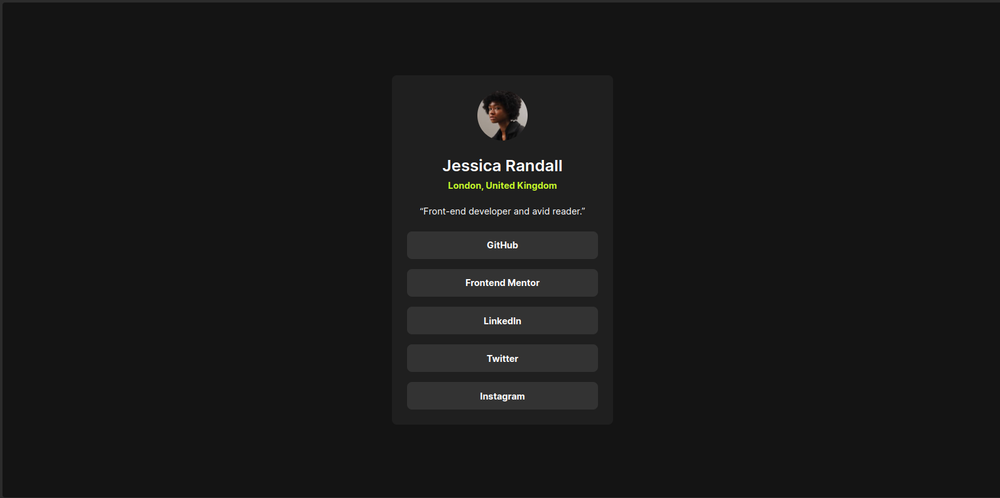

# Frontend Mentor - Social links profile solution

This is a solution to the [Social links profile challenge on Frontend Mentor](https://www.frontendmentor.io/challenges/social-links-profile-UG32l9m6dQ). Frontend Mentor challenges help you improve your coding skills by building realistic projects. 

## Overview

### The challenge

Users should be able to:

- See hover and focus states for all interactive elements on the page

### Screenshot

### Links

- Solution URL: [view on github](https://github.com/MikeyOnyedika/social-links-profile-FEMC)
- Live Site URL: [sociallinksprofilefemc.netlify.app](https://sociallinksprofilefemc.netlify.app/)

## My process

### Built with

- Semantic HTML5 markup
- CSS custom properties
- Flexbox
- Mobile-first workflow

### What I learned

There really wasn't any new thing I learnt persay, but I got to practice my css flexbox skills and responsive design skills.

## Author

- Frontend Mentor - [@MikeyOnyedika](https://www.frontendmentor.io/profile/MikeyOnyedika)